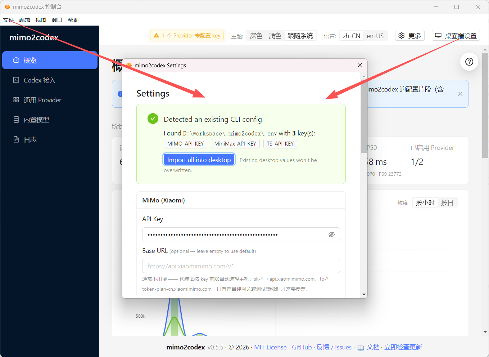

# 版本日志（Tag Log）

<p>
  <a href="./tag-log.md">English</a> ·
  <a href="./tag-log.zh.md"><strong>简体中文</strong></a>
</p>

mimo2codex 的版本发布历史，按 tag 倒序排列。

**类别标签说明**

- **[new]** / **[feat]**：新增功能
- **[fix]**：bug 修复
- **[opt]** / **[refactor]**：优化 / 重构
- **[doc]**：文档相关
- **[test]**：测试用例

---

## v0.5.26 (upcoming)

- **[new]** **内置支持 `MiMo-V2.5-Pro-UltraSpeed`**（issue #70）：小米新出的万亿参数（1T）旗舰、500-1000 tok/s「体验模式」现已作为内置模型被识别。此前发送 `mimo-v2.5-pro-ultraspeed` 会**被静默改写成 `mimo-v2.5-pro`**（实际跑的是 Pro 而非 UltraSpeed），且 admin UI 里选不到它。现在它会原样路由、出现在模型目录 /「Codex 启用」页，`print-config` 也会列出。按官方规格声明为纯文本 + 深度思考 + 工具调用、1M 上下文、131072 最大输出。联网搜索**关闭**（官方能力未列）——若你在 PAYG 账户上开了 Codex 联网搜索，UltraSpeed 转发 `web_search` 时可能 400，对该模型请关掉。**使用限制：**UltraSpeed 需申请开通（每日限量审批，在 https://platform.xiaomimimo.com/ultraspeed 申请），且**仅在按量付费 API host（`sk-` key）上提供**；套餐订阅（`tp-`）账户用不了。admin 的「Codex 启用」页会把它标为**受限**（悬停看说明），用 `tp-` key 选 UltraSpeed 会被前置拦截、给出清晰提示（`model_requires_payg`），而不是上游那种让人困惑的 model-not-found。

---

## v0.5.25

- **[new]** **数据库瘦身——一键清理 + VACUUM、大小可见、自动维护**（issue #67）：`data.db` 会无限膨胀（有用户涨到 6 GB），因为默认**完整**保存请求/响应体且永不清理，而删日志也不还磁盘（SQLite 删行只把空闲页留在文件里，要 `VACUUM` 才缩）。本次新增：(1) Logs 页**「清理旧日志」/「清空全部」**会在删除后**自动 VACUUM**（文件才真正变小，而不只是释放内部页），Logs 页顶部显示**实时数据库大小**；(2) **按大小阈值自动维护**——设置 `logging.maxDbSizeMb` 后，每 6 小时维护会清理最旧日志并做节流 VACUUM（≤ 每天一次）；(3) **仅对全新安装启用更省空间的默认值**——保留 30 天 + 只存出错请求体，已有安装迁移为显式 `off`/`full`，升级绝不删任何人的历史日志或改变捕获方式。新增端点：`GET /admin/api/db/size`、`POST /admin/api/db/vacuum`（带可用磁盘预检）、`DELETE /admin/api/logs?all=1|keepDays=<n>`。

- **[fix]** **桌面端在 Intel（x86_64）macOS 上崩溃——admin UI 404**（issue #69）：macOS 的 **x64** 安装包里打进了 **arm64** 的 `better-sqlite3` 原生模块，于是 Intel Mac 上 sidecar 加载失败（`incompatible architecture`），admin 数据库不可用，admin 路由从未注册，所有 `/admin/` 请求都 404。根因：sidecar 构建传的是 `npm_config_target_arch`/`_platform`，但 **prebuild-install**（better-sqlite3 下载预编译二进制的工具）只认 `npm_config_arch`/`npm_config_platform`——于是交叉构建（arm64 CI runner → x64 包）静默 fallback 到 runner 的架构，下载了错误架构的 prebuild。只有 macOS x64 受影响（Windows x64 / macOS arm64 都是同架构构建，fallback 碰巧正确）。两处修复：(1) `build-sidecar.mjs` 现在设置 `npm_config_arch`/`npm_config_platform`（保留 `target_*` 作为 node-gyp 源码编译兜底）；(2) 新增**静态架构校验**（`scripts/detectNativeArch.mjs`，解析 Mach-O/PE/ELF 头），**每次**构建都跑——包括过去会跳过可执行 smoke test 的交叉构建——错误架构的模块现在会让 CI 失败，而不是发布给用户。

- **[fix]** **`install.sh` / `install.ps1` 克隆了不存在的仓库**（issue #66 跟进）：引导脚本的默认 `MIMO2CODEX_REPO` 一直是模板占位符 `your-org/mimo2codex`，导致 `curl … | bash` / `irm … | iex` 在 clone 步骤就直接失败。现已指向真实仓库。这两个 git-clone 引导脚本**并非**文档推荐的安装路径（推荐 `npm install -g mimo2codex` 或 Docker），所以多半不是 #66 的根因——但仍是个实打实的 bug，一并修掉。

---

## v0.5.24

- **[new]** **上下文自动压缩**（issue #65 后续）：长会话每轮都把完整历史重发，一旦接近模型上下文上限，上游要么 400、要么 prefill 太慢导致断流。mimo2codex 现在会估算输入大小，超过**随模型窗口缩放**的 token 阈值（`contextWindow × 阈值`，**阈值默认 0.8**——例如 1M 窗口约 800k、256k 窗口约 205k）时，**把较旧的中段对话**经同一个模型总结成一条紧凑摘要，保留开头的 system 消息和最近若干轮原文。切分点一定落在干净的 `user` 边界，绝不拆散 tool_call/tool_result 配对；图片 base64 绝不喂给摘要调用；稳定的前缀会被缓存，避免每轮重复总结。尽力而为：摘要调用失败则原样保留历史。默认**开**；可用 `MIMO2CODEX_AUTO_COMPACT`（0=关）、`MIMO2CODEX_AUTO_COMPACT_THRESHOLD`，或绝对值 `MIMO2CODEX_AUTO_COMPACT_AT_TOKENS`（用于「对外报的窗口大于真实可用上限」的上游）调整——同样暴露为 admin 设置 `codex.autoCompactEnabled` / `codex.autoCompactThreshold` / `codex.autoCompactAtTokens`。压缩在 keepalive 已激活时进行，摘要往返不会重新引入静默连接。

- **[fix]** **请求体上限可配置，上传超大图片不再断连**（issue #65）：请求体上限原本硬编码 16MB，超限会在上传途中 `destroy()` 套接字——Codex 看到的是「error sending request for url」而非干净错误。现在上限**默认 64MB 且可配置**（`MIMO2CODEX_MAX_REQUEST_BODY_MB`），超限会先把剩余 body 读完再返回客户端真正能收到的 **413**。

- **[fix]** **大上下文 / 上传图片时的「stream disconnected before completion」**（issue #65）：代理过去要先 `await` 到上游的第一个字节、才会给 Codex 发数据，而 Node 的 `fetch`（undici）默认把这段等待上限定在 300s。一旦 prefill 很慢（会话很大，或一张 base64 图片把请求体撑大），就可能超过这个窗口——而此时 Codex 盯着一条没有任何字节的连接，触发了**它自己**的空闲超时。三处协同修复：(1) 现在无论是否配置代理，都安装一个**全局 undici dispatcher**，应用可配置的上游超时（默认 **10 分钟**，`0` = 关闭）——`MIMO2CODEX_UPSTREAM_HEADERS_TIMEOUT_MS` / `MIMO2CODEX_UPSTREAM_BODY_TIMEOUT_MS`；(2) header/body **超时不再触发重试风暴**——直接以清晰的 504 快速失败，而不是把几 MB 的请求体重发最多 6 次；(3) 两条流式路径现在都在 `await` 上游**之前**就 **flush SSE 头并起 keepalive**，让 Codex 在长 prefill 期间持续收到 `: keepalive` 注释。代价：一旦 200 SSE 流已经发出，上游的终态错误（如上下文超限的 400）会以 SSE `error` 事件下发，而不是 JSON 4xx。启动 banner 现在会显示当前生效的超时，带图片的流式请求也会打日志（含大致体积）。

---

## v0.5.23

- **[new]** **Windows：隔离的 Codex CLI 启动器**（PR #64，感谢 @Kaiyuan GONG）：新增脚本 `scripts/codex-mimo-isolated.ps1`，让你用 **Codex CLI** 经 mimo2codex 接 MiMo，又**不动 Codex 桌面端常用的 `~/.codex`**。它用独立的 `CODEX_HOME=%USERPROFILE%\.codex-mimo`，首次运行时在那里写入最小的 `auth.json` + `config.toml`，若 `:8788` 没在监听就自动拉起代理，打印本地 API/admin 地址，然后把其余参数原样转发给 `codex`。脚本不硬编码 API key —— 用 `mimo2codex init` 配置。完整说明见 `doc/codex-cli-isolated-windows.zh.md`。

- **[fix]** **保存带重复 shortcut 的 generic provider 不再把后台搞挂（`/admin/` 404）**（issue #63）：`providers.shortcut` 是 `UNIQUE` 列，但保存路径只对 provider `id` 去重、不查 `shortcut`。一个 generic 的 shortcut 撞上内置（`mimo` / `ds`）或撞上另一个 generic 时，保存能成功，却会在**下次启动**的 DB seeding 阶段抛 `UNIQUE constraint failed: providers.shortcut`，再被 cli.ts 的兜底逻辑变成「admin 禁用」—— 于是所有 `/admin/` 请求都 404。两层修复：(1) `writeSpecsToFile` 现在**保存时**就拦下冲突的 shortcut 并给出清晰提示（预置了内置的 shortcut）；(2) DB seeding 按 shortcut 去重（`dedupeProvidersByShortcut`）——重复项**跳过并打 warn**，而不是让整个 seeding 崩掉，这样已经存了脏 `providers.json` 的用户下次启动也能恢复后台。

- **[fix]** **generic provider 的 `enhanceErrorPreset: "kimi"` 不再被静默丢弃**：`kimi` 本就是合法的 `ProviderPresetId`（`src/providers/presets.ts`），但 providers.json 解析器此前只认 `sensenova` / `minimax`，导致 Kimi 的错误诊断预设永远存不下来。现在和其它预设一并承认。

---

## v0.5.22

- **[new]** **多模态 Fallback —— 请求带图片时自动切换到 vision 模型**（PR #58，感谢 @Grub）：当请求包含图片但当前模型看不了图（如 `mimo-v2.5-pro`）时，代理会把 upstream model 改写成支持 vision 的模型（默认 `mimo-v2.5`），避免图片被静默丢弃——Responses 和 Chat 两条路径都生效。**已收敛为 MiMo 专属、不影响其他模型**：vision 能力是 MiMo provider 的特性（`provider.supportsVision`），只有 MiMo 会触发 fallback，DeepSeek / generic 等请求完全不受影响。即便在 MiMo 下，若目标 vision 模型解析不出来也会跳过、保持原模型。开关和目标模型在 admin UI → Codex 接入页的「多模态 fallback」卡片；**默认关闭**——混用 vision / 非 vision 模型时再开。

---

## v0.5.21

- **[fix]** **持续型 429 限流不再中断会话（v0.5.20 重试的补强）**：v0.5.20 加了代理侧的 429/5xx 重试，但默认预算（重试 3 次、约 3.5 秒）只能扛住亚秒级抖动。真正按分钟计的配额限流（`429 Too many requests / limitation`，且经常**不带 `Retry-After` 头**）仍会把预算耗尽，于是原始 429 被透传给 Codex，Codex 再耗尽自己的重试，又报出「exceeded retry limit, last status: 429」。现在默认重试预算放大为：**重试 6 次、指数退避封顶 12 秒（总计约 28 秒）**，让几秒到几十秒的配额限流在放弃前自行解除。仍可被取消、仍尊重上游的 `Retry-After`、仍可通过 `MIMO2CODEX_UPSTREAM_MAX_RETRIES`（上限提到 12）/ `MIMO2CODEX_UPSTREAM_RETRY_BASE_MS` 调整。代价：限流期间单个请求最长会等约 28 秒才失败，而不是原来的约 3.5 秒。

- **[new]** **面向长期运行部署的日志存储控制**：**解决什么问题** —— 以前每次请求/响应都会被完整记录并永久保存，所以在常驻部署（Docker、团队/多人共享）里 `data.db` 会无上限地膨胀：占磁盘、拖慢备份和日志页，还会把完整对话内容留存得比你出于隐私考虑想要的更久。现在有两个旋钮来封顶。`MIMO2CODEX_LOG_BODY_MODE=full|errors-only|off`（日志页 →「存储设置」也能设）可保留全部调试细节、只保留失败请求的 body（够排障、体积小很多）、或完全关闭 body 记录。`MIMO2CODEX_LOG_RETENTION_DAYS=<n>`（同一处）会自动删除超过 `n` 天的旧记录——启动时及运行期间每 6 小时各跑一次；设为 `0` 关闭清理。典型用法：小 VPS / 团队代理设 `errors-only` + `30`，数据库就稳定在可控大小，而不会几个月下来越滚越大。设置存在 DB 里（改完免重启），且 env/CLI 显式设置时优先。

---

## v0.5.20

- **[fix]** **上游 429 / 5xx 瞬时错误不再中断会话（「exceeded retry limit, last status: 429」）**：以前代理会把限流直接透传回 Codex，Codex 用完自己的 `request_max_retries` 就放弃，用户只能手动点「继续」。现在 mimo2codex 自己兜底：`postUpstream` 对 `429` 和 `500/502/503/504`（以及网络连接失败）做指数退避 + 抖动重试，并遵循上游的 `Retry-After` 头（上限 10 秒，避免 Codex 等到超时）。重试可被中断——退避期间 Codex 取消会立即停止。非可重试错误（400/401/403 等）仍快速失败。可通过 `MIMO2CODEX_UPSTREAM_MAX_RETRIES`（默认 3）和 `MIMO2CODEX_UPSTREAM_RETRY_BASE_MS`（默认 500）调整。

- **[fix]** **「写入文件并启用」不再抹掉你 config.toml 里的其它设置**：以前应用一个模型会用 `model` + `model_provider` + `[model_providers.<key>]` 整体覆盖 `~/.codex/config.toml`，悄悄丢掉用户其余配置——`[projects]` 信任级别、`[mcp_servers]`、`[windows] sandbox`、`model_reasoning_effort`、`[notice.model_migrations]`、注释统统消失。现在切换模型走**外科式合并**（`src/codex/tomlMerge.ts`）：只重写我们管理的四个键（`model`、`model_provider`、`model_context_window`、`model_max_output_tokens`）和我们自己的 `[model_providers.<key>]` 表块，其它字节原样保留。全新安装（没有 config.toml）仍然写入带备选模型注释的首次引导片段。每次写入前依旧先备份，历史配置完全可追溯复原。
- **[new]** **会话管理——跨 provider 浏览所有 Codex 会话并可迁移**（左侧新增 Tab）。Codex 桌面端把每个会话存在 `~/.codex/state_<N>.sqlite`（`threads` 表）里，并打上一个 `model_provider` 标记、按它筛选会话列表——这正是「在 mimo2codex 里切 provider 后 ds 和 mimo 的会话相互看不见」的原因。新 Tab 只读读取该数据库，把所有会话按 **provider → 项目（cwd）→ 会话** 分组展示，与当前激活的 provider 无关。展示细节：去掉项目路径里的 Windows 扩展前缀 `\\?\`（避免同一项目被拆成两组）、修正会话时间显示（Codex 以秒存储）、过长标题中间省略只占一行、默认只展开第一个 provider 分组。由于一个会话无法在多个 provider 间「共享」（一行只有一个 provider），因此提供**迁移**：「迁移到…」会改写该会话的 `model_provider`（数据库 + rollout 文件首行 `session_meta`），重启 Codex 后即归到所选 provider 下。**批量迁移**：勾选复选框（选择可跨所有项目/provider 表格），点「批量迁移选中」即可把它们一次性迁到同一个 provider。安全措施：改动前先把整个 state 数据库（含 `-wal`/`-shm`）和 rollout 快照到 `~/.codex/.m2c-backups/sessions/<ts>/`，并在 **Codex 桌面端仍持有数据库锁时拒绝迁移**（返回 `409 codex_running`），避免打开状态下损坏会话。仅本地模式可用（服务端部署无法访问操作者的 `~/.codex`）。⚠️ 这会改写 Codex 私有、带版本号的状态——若未来 Codex 改了表结构，该 Tab 会降级为「不可用」而非报错崩溃。
- **[new]** **预览会话聊天记录 + 导出 Markdown**：每个会话行都有「预览」按钮，点开抽屉以 Codex 风格渲染对话——用户/助手消息、推理、工具调用（shell 命令、`apply_patch` 等）及其输出（代码块）。工具/shell 调用**默认折叠**（标题显示工具名 + 命令首行），突出文本对话，点击展开。rollout JSONL 在服务端解析（`src/codex/transcript.ts`）；丢弃注入的 developer/权限指令块、把环境/指令上下文折叠收起，让真实对话更突出。抽屉里的「导出 Markdown」按钮可把整段记录下载为 `.md`。只读，仅本地模式。
- **[opt]** **模型改写日志：现在默认静默 + 顶栏快速开关**（基于 [PR #49](https://github.com/7as0nch/mimo2codex/pull/49)，感谢 @oxsean）。当 Codex 发送与 provider 目录不一致的 model id（例如 `gpt-5.4` → `mimo-v2.5-pro`），代理每个请求都会打一条「model fallback applied」INFO 日志。现在**默认静默**，并在管理后台顶栏「更多」菜单加了快速开关「静默模型改写日志」可运行时切换、无需重启。解析顺序为 env > 管理设置 > 静默（`resolveSilentRewrite`）：环境变量 `MIMO2CODEX_SILENT_REWRITE=1`/`true`（或 `0`/`false`）仍优先，且设置后 UI 开关禁用。
- **[new]** **顶栏「当前状态」实时指示器**：当前状态是用户经常要看的，所以挪到顶栏、和其它状态项放在一起，不再占用 Codex 接入页的卡片。它是一个名为「当前状态」的紧凑跑马灯，每 3 秒轮播一项——codex 目录、auth.json 归属、config.toml provider/model、运行时覆盖；运行时覆盖生效时变蓝。点击弹出完整状态（codex 目录及编辑、auth.json、config.toml、运行时覆盖、导出/导入）——宽屏用气泡、窄屏用弹窗。每 30 秒自动刷新。
- **[opt]** **Codex 接入页精简为直接切模型**：「当前状态」卡片挪到顶栏（见上），多余的快速切换栏也去掉了，所以 Codex 接入页现在就剩标题 + 切模型表格（「可启用模型」/「写入文件并启用」）。两段「工作原理」说明和导语此前已折进可折叠的「先决条件」面板（默认折叠）。
- **[new]** **应用配置后顺手重启 Codex**：切换配置要重启 Codex 才生效，所以应用配置（「写入文件并启用」）后会弹出「重启 Codex 让配置生效？」对话框（立即重启 / 暂不）。它会强制关闭正在运行的 Codex 桌面端并重新启动（没在运行就直接启动），不用再自己去找 Codex 窗口关掉重开。Windows：只针对桌面端自身的 `Codex.exe` 进程（按可执行文件路径匹配，因此不会误杀 VS Code 扩展的 `codex` 引擎），并通过 Store 的 AppUserModelID 重新拉起。macOS：尽力而为，`pkill` + `open -a Codex`。仅本地模式可用；不支持的平台会提示你手动重启。
- **[new]** **桌面端：启动时询问是否打开 Codex**：启动 mimo2codex 桌面端时，如果检测到 Codex 桌面端没在运行，会弹窗询问是否现在打开（「打开 Codex」/「暂不」），确认后帮你启动。检测只针对真正的 Codex 桌面端进程（按可执行文件路径）；启动走 Windows 的 Store AppUserModelID / macOS 的 `open -a Codex`。Codex 已在运行、首次安装设置、以及开机自启动这几种情况会跳过（避免开机时打扰）。检测与启动复用应用内「重启 Codex」的同一套底层逻辑。
- **[opt]** **桌面端：双击托盘图标直接打开控制台**：以前双击系统托盘图标没有反应（只有右键能出菜单）。现在双击直接在应用内打开控制台——一步到位，无需右键再点菜单。菜单仍走右键。（退出确认弹窗本就把「Quit」放在「Cancel」左侧、并以 Cancel 为安全默认，所以这一项原本已符合要求。）
- **[opt]** **配置备份迁入独立的 `~/.codex/.m2c-backups/` 目录**：每次切换产生的 `auth.json.bak.*` / `config.toml.bak.*` 快照过去直接堆在 `~/.codex/` 顶层，污染 Codex 应用和 CLI 也要读的目录列表。现在统一放进隐藏子目录 `.m2c-backups/`（仍在 codex 目录内，恢复逻辑不变）。已有的旧版同级备份会在首次读取时自动迁移过去。
---

## v0.5.6

- **[fix]** **长对话 400 "unexpected end of data: line 1 column 46 (char 45)"**：上游 SSE 流在某次工具调用中途结束（输出 token 用尽、网络中断、客户端取消、思考预算用光……）时，Codex 会把那条**被截断的 `tool_call.arguments`** 当成完整 JSON 持久化进会话历史。从此该会话每次新请求都把这条坏 tool call 原样回放给严格上游（MiMo / DeepSeek / SenseNova……），上游在校验阶段重新 `json.loads` 这个字符串字段时在截断点炸出 400 —— 会话看起来"用着用着就坏了"，必须新建对话才能恢复。本版本加了**三层防御**：(1) 流式回传到 Codex 之前（`streamToSse.finalizeToolCalls`），先校验累加好的 `argsBuffer` 能否 `JSON.parse`，不能就替换为 `"{}"` 并 WARN 一条带因果的日志（长度截断 vs. 其它），让坏值根本不会写进 Codex 历史；(2) 非流式 `respToResponses` 同样设防；(3) 出站到上游之前（`reqToChat` 的 `function_call` 分支），对历史 `arguments` 再校验一次失败就改写 `"{}"` —— 这让被旧版代理污染的存量会话立刻恢复正常。配对的 `tool` 消息保持原样、`removeOrphanToolMessages` / `ensureToolCallsHaveOutputs` 不变。万一上游真返回了这种 400，`contextOverflow.detectMalformedJsonField` 会把原始报错改写成双语恢复提示（"升级到新版 mimo2codex / 或新建 codex 会话"）而不是把那段晦涩报文丢给用户。
- **[opt]** **桌面端 Settings 支持多 provider key + 自定义 base URL**（[PR #43](https://github.com/7as0nch/mimo2codex/pull/43) — A1，感谢 @starlsd93-sudo）。原先的 Settings 窗只能选一个 provider 填一个 key，同时养 MiMo + DeepSeek 的用户必须切换 provider 多次保存。新版改成把三个 provider（MiMo / DeepSeek / Generic）的 API Key + 可选 Base URL 同框显示，Generic 还多了 `GENERIC_DEFAULT_MODEL` 字段。只要填了任意一个 provider 的 key 就能完成首次安装；Base URL 留空走默认（MiMo / DeepSeek 内置 host），需要走 TP 订阅或企业 tenant 才填。MiMo Base URL 下面专门加了一行提示，说明代理会按 `sk-*` / `tp-*` 前缀自动选择主机，避免新手粘错地址被 401。打开路径：系统托盘图标 → Settings…，或顶部菜单「文件 → 设置… (Ctrl+, / Cmd+,)」。界面长这样：

  
- **[new]** **桌面端首次启动可一键导入老 CLI 配置**（[PR #43](https://github.com/7as0nch/mimo2codex/pull/43) — A3，感谢 @starlsd93-sudo）。如果你机器上同时有 `~/.mimo2codex/.env`（来自 `npm install -g mimo2codex` 安装），桌面端 Settings 会自动检测并在欢迎页弹一个「Import all into desktop」按钮，把 API key / base URL / proxy 等变量一次性复制到桌面端的 AppData 配置里。已经在桌面端填过的字段**不会**被覆盖（会作为"skipped"提示给你）；导入后这些值会自动填到上面的多 provider 表格里，你 review 一下点 Save & Restart 即可。**对迁移过数据目录的用户友好**：如果你之前通过 admin UI 把 CLI 的 dataDir 迁移到了别处（比如 `D:\workspace\.mimo2codex`），检测会读 `~/.mimo2codex-pointer.json` 指针文件、直接定位到真正的活动 .env，不会去导入已经废弃的 `~/.mimo2codex/.env` 残留。
- **[new]** **桌面端应用菜单中文化 + 左上角直接调起设置窗**（[PR #43](https://github.com/7as0nch/mimo2codex/pull/43) — A2，感谢 @starlsd93-sudo）。之前 Windows / Linux 桌面端顶部菜单条全是 Electron 默认的英文「File / Edit / View / Window / Help」，没有「设置」入口，用户只能去系统托盘点 Settings 太隐蔽。本版本三平台统一了一套中文菜单（文件 / 编辑 / 视图 / 窗口 / 帮助），文件菜单第一项就是「设置… (Ctrl+, / Cmd+,)」直接调起 Electron 设置窗。同时 admin web UI 顶栏也有冗余按钮「桌面端设置」（仅在桌面壳里显示，通过 `/admin/api/desktop/sentinel` 探测），点了走 file-based 信号通路（`<dataDir>/.desktop-signal.json` → Electron main `fs.watch`）打开同一个设置窗，喜欢哪个用哪个。
- **[new]** **Windows 应用图标升级**（[PR #43](https://github.com/7as0nch/mimo2codex/pull/43) — B，感谢 @starlsd93-sudo）。社区贡献了 新版图标，本版本接入了橙色版作为 `package/win/icon.ico`；完整 8 张（橙紫两色 × 64/128/256/512 四个尺寸）全部归档到 `package/brand/contributed-by-starlsd93/`，并附 provenance 说明。macOS `.icns` 这次未动 —— 投稿没附 `.icns` / `tray-Template*.png`，等后续单独 PR 补齐。

---

## v0.5.5

- **[new]** **Windows / macOS 桌面端正式发布（不再 beta）**：经过 v0.4.8 起的 beta 验证，桌面端转 GA。后台跑 mimo2codex、系统托盘 / 顶栏图标管理、admin UI 一键打开、自更新链路全部就绪。命令行版（`npm install -g mimo2codex`）依然不变，两者可共存。下载入口：<https://mimodoc.chengj.online/download>。
- **[fix]** **`tool_search` 工具支持（[issue #41](https://github.com/7as0nch/mimo2codex/issues/41)）**：Codex Desktop 的延迟工具发现工具之前被当未知类型丢，模型发现不了延迟加载的工具，还会刷一串 orphan 警告。现在翻成普通 function 工具，恢复正常。
- **[fix]** **Connector 插件不再报 "unsupported call"（[issue #39](https://github.com/7as0nch/mimo2codex/issues/39)）**：GitHub / Canva / HeyGen / Dropbox / Gmail / Google Drive 这些 connector 依赖 OpenAI 后端的 MCP 运行时，第三方代理实现不了。现在 mimo2codex 把这个情况告诉上游模型，模型会主动建议用 shell + 命令行替代（比如 GitHub 用 `gh`）。
- **[fix]** **运行时覆盖后的多模态判断走真实上游模型**：之前客户端发 `mimo-v2.5-pro`、admin 运行时把它映射到 `mimo-v2.5`（支持识图）时，mimo2codex 还是按客户端那个不支持识图的 id 判断、把图片提前剥掉了。修复后视觉 / 联网能力检查跟着**实际发往上游的模型 id** 走 —— 运行时改模型不用重启，识图、联网立刻按新模型的能力生效。

---

## (v0.4.10 — 2026-05-24)

- **[fix]** **Codex Desktop namespace 工具报 `unsupported call`（[PR #34](https://github.com/7as0nch/mimo2codex/pull/34)，[issue #33](https://github.com/7as0nch/mimo2codex/issues/33)，感谢 @meesii）**：Codex Desktop 调用 namespace 包装的工具（如 `multi_agent_v1` 下的 `spawn_agent`）走 mimo2codex 代理时报 `unsupported call` —— 客户端依赖每个 `function_call` output item 上的 `namespace` 字段来路由到对应的本地 handler，而代理之前在翻译响应时把这个字段丢了。修复：从请求的 `tools` 数组抽出 `toolName → namespaceName` 映射，在非流式（`respToResponses`）和流式（`streamToSse`）两条响应路径上按需附加 `namespace` 字段。不带 namespace 工具的请求（MiMo / DeepSeek / 普通 Codex CLI 等）行为字节级保持一致。

---

## (v0.4.8 — 2026-05-23)

- **[new]** **桌面预览（beta）—— Windows 系统托盘 / macOS 顶栏桌面端**：可选的 Electron 壳子，后台跑 mimo2codex，不用一直挂着终端窗口。首次启动会有个小设置窗让你选 provider 并粘贴 API Key；之后从系统托盘 / 顶栏图标一键打开内嵌的 admin UI（窗内或默认浏览器都行）。sidecar 生命周期（启动 / 停止 / 改设置时重启）完全托管，菜单 **Quit** 干净退出。提供可选的"开机自启"开关。命令行版（`npm install -g mimo2codex`）完全不变，两者可在同一台机器共存 —— 桌面版作为独立的 `v*-desktop` 制品发布。这是 **beta** —— 安装、启动、sidecar、自更新链路还需要真实环境的里程验证，遇到任何卡点请反馈。下载和安装指引：<https://mimodoc.chengj.online/download>。
- **[fix]** **CodeX Desktop string-input 被误判为 probe（[PR #31](https://github.com/7as0nch/mimo2codex/pull/31)，感谢 @85339098-afk）**：OpenAI Responses API 规范允许 `input` 是 string 或 items 数组两种形式；`handleResponses` 里的 probe 形状检测之前只认数组形式，导致 `{model, input: "write hello world"}` 这种 CodeX Desktop 的自然请求被短路成 synthetic 200 + 空 `output: []` —— 看起来像"模型啥也没说"，**完全没有错误信号**。现在 string `input` 非空也会正确通过。把判定逻辑抽成导出的 `isResponsesProbe()` 函数，配套单元测试套件（`test/server.probe.test.ts`），后续不会因为重构再次被回归。

---

## (v0.4.6 — 2026-05-23)

- **[fix]** **DeepSeek V4 400 `Invalid assistant message: content or tool_calls must be set` ([issue #29](https://github.com/7as0nch/mimo2codex/issues/29))**：当某个 assistant 回合由 reasoning + function_call 拼成、且没有可见 text 时（典型场景：Codex Chrome 插件），翻译产物形状是 `{role:"assistant", content: null, tool_calls:[…], reasoning_content:"…"}`。DeepSeek 的严格校验把显式 `null` 当成"两个字段都没有"于是 400。OpenAI Chat Completions 规范规定 `tool_calls` 存在时 `content` 是可选的，现在直接省略该字段而不是发 `null`。reasoning-only 兜底回合（少见：无 text 无 tools）回落到 `content: ""` 以满足"content 或 tool_calls 必须存在"。
- **[fix]** **Windows / pnpm 全局安装 / Node 22 启动崩溃 ([issue #30](https://github.com/7as0nch/mimo2codex/issues/30))**：admin sqlite 启动打开失败时 `mimo2codex` 不再退出。典型原因：pnpm 全局安装布局没拿到对应 Node ABI（`node-v127-win32-x64`）的 `better-sqlite3` prebuilt 二进制，于是 `new Database()` 报 `Could not locate the bindings file`。现在改成打印一段多行告警（包含原始错误信息和针对 Windows / pnpm 的修复建议）然后以 admin 关闭模式继续启动。代理核心（Codex ↔ Chat-Completions 翻译）本来就不依赖 DB —— 这次让命中 binding 缺失的安装方式也能开箱可用。

---

## v0.4.5 — 2026-05-22

- **[new]** **桌面端（Windows 系统托盘 / macOS 顶栏菜单）**：可选的桌面壳子，后台跑 mimo2codex，不再依赖终端窗口常开。首次启动有设置窗让你填 provider + API Key；托盘菜单一键打开 admin UI、查看 sidecar 日志、重启；可选「开机自启」复选框。命令行版安装（`npm install -g mimo2codex`）完全不变，桌面端走单独的 `v*-desktop` GitHub release 分发。下载与安装指南：<https://mimodoc.chengj.online/download>。
- **[opt]** **桌面端 Mac 包改成 `.zip`（原来是 `.dmg`）**：GitHub Actions runner 上的 hdiutil（不论 macos-14 / macos-15）+ dmg 格式（UDZO / ULFO）多次试下来，生成的 `.dmg` SHA 校验过得了，但到真机上 Finder 挂不上（「此电脑不能读取你连接的磁盘」 / 「错误代码 3840」）。`.zip` 简单粗暴、哪里都能用——Finder 双击解压出 `mimo2codex.app`，拖到 `/Applications` 即可。下载页会自动识别格式，以后真要做签名 `.dmg` 再把那个 target 加回来。SHA256 校验、首次启动 `xattr -cr` 清 quarantine 这些都不变。
- **[new]** **代理的支持**：mimo2codex 出站请求支持 `HTTP_PROXY` / `HTTPS_PROXY` / `NO_PROXY` 环境变量，行为与 `curl` / `git` 一致。Docker 部署在 `docker-compose.yml` 的 `environment:` 段声明，本地在 shell / `.env` 里 `export` 都可以。启动 banner 多一行 `proxy:` 回显当前生效的代理，env 是否被识别一眼能看到。`MIMO2CODEX_NO_PROXY_FROM_ENV=1` 可让 mimo2codex 无视代理 env（适合 shell 里为 `curl` / `git` 常驻了代理、但不想让 mimo2codex 跟着走的场景）。
- **[opt]** 上游连接失败的日志补上 underlying cause 的 `code` 和 `message`（如 `ECONNREFUSED` / `ENOTFOUND` / `ETIMEDOUT`），同样的细节注入到 502 的 `UpstreamError.message`，代理端口写错、DNS 解析失败、超时这些情况一眼能分辨。
- **[doc]** proxy-faq §1 改写：明确"系统代理 ≠ 进程代理"——Clash / Surge 等 UI 里点的"系统代理"开关不会自动导出 env；新增 🩺 自检 callout 让用户从启动 banner 一眼看出当前代理状态。§5 新增 `ECONNREFUSED <代理-host>:<代理-port>` 一行（含 Docker 里 `127.0.0.1` 的坑）。

---

## v0.4.4 — 2026-05-21

- **[new]** **官网新增 AI 文档助手 ([mimodoc.chengj.online](https://mimodoc.chengj.online/))**：右下角机器人浮球 —— 常见配置问题（第一次怎么配、为什么 502、通用 provider 怎么接）点开就能问。助手在项目 `doc/*.md` 上跑 tool calling agent 循环检索文档，流式渲染 markdown 回答。思考过程展示在答案上方的可折叠面板里（开始出答案时自动收拢）。接通了 MiMo V2.5 多模态 —— 粘贴 / 拖拽 / 点回形针上传配置截图，AI 直接看图诊断。聊天历史按匿名 client_id 存 localStorage，drawer 头部有「清空对话」按钮。

---

## v0.4.2 — 2026-05-21

- **[new]** **Admin UI 一键迁移数据目录**：右上 ⚙️ 设置 → 本地数据目录 → 迁移到新目录。选目标路径 → 预览将复制的文件数和大小 → 进度条流式复制 SQLite + `.env` + `providers.json`。迁移期间服务进入维护模式（503），原目录保留待用户验证后手动清理；失败自动回滚（清空目标已写入的部分 + 重新打开原目录）。完成后顶部出现常驻提示 banner 提醒用户重启生效。解析优先级变为 CLI > env > 指针文件（`~/.mimo2codex-pointer.json`）> 默认 `~/.mimo2codex/`。
- **[doc]** **官方文档站上线 [mimodoc.chengj.online](https://mimodoc.chengj.online/)**：完整文档与教程的统一入口。admin 后台 footer 已加 📖 直达链接和悬浮提示，方便用户随时查阅。
- **[fix]** **本地代理模式隐藏 server-only Codex 入口**：「Codex 接入」页的「导出到本地」/「从本地导入」按钮和 `History` tab 只在 Docker 鉴权部署模式（`authMode=on`）下有意义 —— 多运维之间互传渲染好的 `auth.json` + `config.toml` 配置 bundle。本地单机模式下 mimo2codex 直接把这些文件写到 `~/.codex/`，按钮属于噪音。现已按 `authMode === "on"` 条件渲染。

---

## （v0.3.0）

- **[new]** **Docker 鉴权部署正式发布（GA）**：v0.2.17 作为预览验证后，**Docker 鉴权模式**作为稳定特性发布 —— 用户注册 / 登录系统、每用户独立的 m2c 代理 API key、BYOK（自带上游 key）、Gitee / GitHub OAuth、Codex 客户端配置 bundle 下载。把 mimo2codex 部署到 Docker / 内网 / 小圈子时不再泄漏上游 key。本地单机运行（`authMode` 默认 `off`）完全不受影响。完整教程：[doc/auth-deployment.zh.md](./auth-deployment.zh.md) —— 含 Docker compose、首次启动 bootstrap、OAuth 配置、故障排查。
- **[fix]** **工具列表去重防御（[issue #20](https://github.com/7as0nch/mimo2codex/issues/20)）**：新版 Codex CLI / Desktop / DeX 会发出重名工具（典型样例：顶层 `_fetch` 函数 + namespace 展平后再来一个 `_fetch`），导致 MiMo 上游 400 `"tools contains duplicate names: _fetch"`。reqToChat 在工具合并后按 `function.name` / 内置 `type` 二维 keep-first 去重；重复时记 `WARN` 日志告知用户这是客户端 bug。
- **[new]** **思考模式混合历史防御**：检测到会话历史里有 assistant 消息缺 `reasoning_content`（典型场景：用户在同会话切换"默认开启思考"开关），自动给这些历史消息回填占位符 `"(this turn ran without thinking mode)"`，**思考保留为开**，避免上游 MiMo / DeepSeek 400 `"reasoning_content must be passed back"`。配套 INFO 日志。
- **[opt]** 控制台日志降噪：`WARN client model rewritten on the way upstream` → `INFO model fallback applied — client sent unknown model id, request continues with provider default`。降级到 INFO + 改文案，不再让人误以为是错误（实际是 graceful fallback，请求正常完成）。
- **[doc]** 新增双语 [代理 / 网络 FAQ](./proxy-faq.zh.md)：mac & win 各自代理设置、502 / ECONNREFUSED / DNS / TLS-MITM 等错误码自查表、`gpt-5.4` placeholder 来源解释、思考模式混合历史现象说明。
- **[doc]** 新增双语 [版本日志](./tag-log.zh.md)：把 README 顶部 `<details>` changelog 块迁出，按 tag 倒序、`[new]/[fix]/[opt]/[doc]` 分类，含全部 44 个历史 tag。

---

## v0.2.17 — 2026-05-19

- **[new]** **Docker 鉴权模式预览版**：用户可注册登录，生成 mimo2codex 专属代理 API 的 key（m2c key）。在 Docker / 内网 / 小圈子部署时，把 `OPENAI_API_KEY` 字段的 `mimo2codex-local` 替换成生成的 m2c key，避免上游 key 被滥用。本地单机运行（`authMode` 默认 `off`）不受影响。

> ⚠️ **v0.2.17 是预览版本**，作为 Docker 鉴权部署的首发试用。**v0.3.0 是正式 GA 版本**，请生产环境使用 v0.3.0+。详见 [鉴权与部署](./auth-deployment.zh.md)。

## v0.2.16 — 2026-05-19

- **[opt]** Admin UI 紧凑化：内容更紧凑、删掉无用展示，减少视觉噪声。

## v0.2.15 — 2026-05-18

> 含 beta 系列 `v0.2.15-beta.0/1/2`（SenseNova 模型适配 + 思考微调 + Kimi 适配）。

- **[new]** **思考模式 admin UI 化**：「Codex 启用」页新增「思考模式」全局卡片。
  - **思考 开/关**：写入 settings 持久化，不用每次重启加 `--disable-thinking`；改完立即对新请求生效（无需重启）。关闭后所有 provider 都不思考（mimo / deepseek 发 `thinking:{type:"disabled"}`，sensenova / 其他 generic 发 `reasoning_effort:"none"`）。
  - **强制高强度思考**：Codex 没在请求里传 `reasoning.effort` 时，兜底注 `reasoning_effort:"high"`。默认关，开启时显示明显副作用警告（账单可能上涨）。CLI `--disable-thinking` 仍优先。
- **[new]** **Kimi (Moonshot) preset**：admin UI 输入 `https://api.moonshot.cn/v1`（或 `moonshot.ai`）自动识别为 Kimi，套上 `dropReasoningEffort: true`，避免 Kimi 不识别 `reasoning_effort` 时 400。覆盖 `kimi-k2.6` / `kimi-k2.5` / `kimi-k2-thinking` / `kimi-k2-thinking-turbo` / `moonshot-v1-{8k,32k,128k}`。详见 [doc/kimi.zh.md](./kimi.zh.md)。
- **[new]** **Docker 部署**：新增 `Dockerfile`（多阶段 alpine 构建，~70MB）+ `.dockerignore` + GitHub Actions workflow（**自动构建 `linux/amd64 / linux/arm64` 双架构镜像，推送到 ghcr.io/7as0nch/mimo2codex**）；`docker-compose.yml` 一键起，数据目录挂在本地 `./.mimo2codex/`（sqlite + providers.json + admin UI 配置跨容器重建持久化）；env 支持 `.env` 文件挂载或 `-e` / `environment:` 直传 key。mac / Windows / Linux 全平台通吃。基于 [#15](https://github.com/7as0nch/mimo2codex/pull/15)（感谢 @hufang360）。
- **[new]** **SenseNova (商汤) 模型适配**（来自 beta.0/1）。

## v0.2.14 — 2026-05-15

- **[fix]** `.env` 配置 example 文件新增注释，避免初次配置时漏看字段含义。

## v0.2.13 / v0.2.12 / v0.2.11 / v0.2.10 — 2026-05-15

- **[new]** 版本更新检查（check 上游 npm registry 是否有新版）。多次迭代修补（连发 4 个 patch）以打磨网络容错、缓存策略与提示文案。

## v0.2.9 — 2026-05-15

- **[new]** 新增 `.env` 通用配置方案：`mimo2codex init` 后填入 key 即可，跨平台一份配置。

## v0.2.8 — 2026-05-15

> MiniMax / 严格 OpenAI 兼容上游接入修补合集（PR #12）。

- **[fix]** `reqToChat`：不再发 `strict: null` 到上游（MiMo Pydantic schema 拒绝 null，会 400 `"Input should be a valid boolean"`）。修 [issue #11](https://github.com/7as0nch/mimo2codex/issues/11)。
- **[fix]** `minimax-compat`：一键预设不再默认删 `stream_options` / `parallel_tool_calls`。
- **[feat]** `minimax-compat`：响应侧 inline `<think>...</think>` 切到 `reasoning_content`。
- **[feat]** webui providers 表单加「严格 OpenAI 兼容」开关组（minimaxCompat 等）。
- **[feat]** generic provider 接 MiniMax 兼容补丁（[issue #7](https://github.com/7as0nch/mimo2codex/issues/7)）。

## v0.2.7 — 2026-05-15

- **[new]** 全新 webui（**Ant Design 5** 重写）：深浅主题、中英双语 i18n、视口锁定 sider + footer 固定布局、Token 趋势平滑曲线。
- **[new]** 新增 `.env.example` + **Bash / PowerShell 一行命令注入 key** 脚本（`.env` 已 gitignore）。
- **[new]** 「Codex 启用」每行加 **⚡探测** 按钮：发最小 ping 验证 key / baseUrl / 模型 id 是否通。
- **[new]** Token 趋势图融合**缓存命中柱**（绿柱 = 命中、灰柱 = 提示总量）+ 窗口聚合命中率。
- **[new]** 支持**修改 Codex 目录**：settings 配置或 `CODEX_HOME` 环境变量。

> 含 beta 系列 `v0.2.6-beta.1/2/3`：MiMo 全部模型 `contextWindow` 128K → 1M（对齐 DeepSeek，解 Codex 256K 配置 400）；webui 重构 PR #1~#6（antd 5 引入、Setup/Models/CodexEnable 主题化、Logs 表格化、Dashboard 缓存命中、视口高度锁定等）。

## v0.2.6 — 2026-05-14

- **[new]** **「Codex 启用」页面**（**替代 cc-switch**）：admin webui 一键写入 `~/.codex/auth.json` + `config.toml`。
- **[new]** **运行时覆盖**：无需重启 Codex 即可换上游 model。
- **[new]** Codex 备份永久保留 + 半残 pair 恢复 + 手动删除：原文件自动备份，**首次覆盖外部 auth.json 时的备份永久保留**——切换 100 次模型也找得回原始配置。
- **[fix]** `removeOrphanToolMessages`：DeepSeek V4 session 中断时丢弃孤儿 tool 消息，避免 400 `"Messages with role 'tool' must be a response to..."`（修 [PR #10](https://github.com/7as0nch/mimo2codex/pull/10) / [issue #8](https://github.com/7as0nch/mimo2codex/issues/8)）。
- 详见 [doc/codex-enable.zh.md](./codex-enable.zh.md)。

## v0.2.5 — 2026-05-14

> 含 beta `v0.2.5-beta.1`。

- **[feat]** MiMo / DeepSeek 文档对齐。
- **[fix]** DeepSeek `tool_calls` 400 修复。
- **[feat]** Friendly context overflow 错误提示：上游 context 超限时给可读的 `/compact` 引导，而不是裸 400。
- **[feat]** Beta 发版流程（`npm run release:beta`）。

## v0.2.4 — 2026-05-13

- **[test]** 补 `selectProvider` 两段优先级回归测试。
- **[doc]** 同步通用 provider 路由优先级文档。

## v0.2.3 — 2026-05-13

- **[fix]** 根据[小米官方公告](https://platform.xiaomimimo.com/docs/zh-CN/usage-guide/passing-back-reasoning_content)修复 MiMo `reasoning_content` 回传问题。

## v0.2.2 — 2026-05-13

- **[fix]** 工作流（GitHub Actions）修补。

## v0.2.1 — 2026-05-12

- **[new]** 添加 `mimoskill` 支持：图像生成、OCR 等能力（用 Python stdlib，无 pip 依赖）。

## v0.1.16 ~ v0.1.19 — 2026-05-12

- **[new]** `mimoskill` 早期迭代（v0.1.17 ~ v0.1.19）：图像生成、OCR、宠物生成功能逐步打磨。
- **[new]** v0.1.16：新增其他模型支持，默认 mimo / deepseek，同时支持 Responses API 原生对接（`wireApi="responses"`）。

## v0.1.15 — 2026-05-12

- **[fix]** 注册 `mimo-v2.5` 视觉模型为内置目录，避免静默降级到 `mimo-v2.5-pro`（导致用户传图时被丢弃）。

## v0.1.1 ~ v0.1.14 — 2026-05-09 ~ 2026-05-10

项目早期迭代版本（v0.1.1 = 2026-05-09 首次公开发布）。这一阶段没有详细 changelog，主要工作：

- 搭建 mimo / deepseek 双 provider 基础。
- Responses API ↔ Chat Completions 双向翻译核心（`reqToChat` / `respToResponses` / `streamToSse`）。
- 第一版 webui（Token / Logs / Settings 基础页）。
- SQLite 持久化（聊天日志、模型目录、runtime settings）。
- CLI 工具：`mimo2codex init` / `update` / `print-config` / `print-cc-switch`。

完整 commit 流水可通过 `git log v0.1.1..v0.1.14 --oneline` 查看。

---

## 发版流程

发版命令在 [package.json](../package.json) 里：

```bash
npm run release:patch    # x.y.Z+1
npm run release:minor    # x.Y+1.0
npm run release:major    # X+1.0.0
npm run release:beta     # 预发布
```

完整 runbook 见 [PUBLISHING.md](../PUBLISHING.md)（仓库根目录）。
